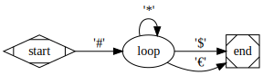

# csly-cli

[](https://coveralls.io/github/b3b00/cslycli?branch=main)
[](https://github.com/b3b00/cslycli/blob/main/LICENSE.md)
[](https://www.nuget.org/packages/csly-cli)

## Presentation

CSLY CLI is a CLI companion tool for [CSLY](https://github.com/b3b00/csly). It helps quickly test a CSLY lexer/parser without the need to code it.
It describes the lexer/parser as a text file (ala yacc) with dedicated notations for CSLY specificities.

C# sources can also be generated to bootstrap real development using the prototyped parser. 

CSLYCLI will only generate à lexerparser pair It will never be able to interpret the course code,this is entirely your responsibility.

## installation

```
dotnet tool install -g csly-cli
```

update :

```
dotnet tool update -g csly-cli
```

## usage

There are 4 usages of csly-cli :
  - test a parser specification against a source code.
  - generate C# source files for CSLY.
  - extract parser specification file from an existing lexer/parser pair C# source file.
  - extract parser specification file from an existing .Net assembly containing a lexer/parser pair.
    


### testing the parser

the test command tries to parse a source file according to a grammar specification file and produces :
  - error messages if 
    - grammar specification is erroneous.
    - source file does not comply to grammar.
  - the syntax tree produced by the parser in 2 possible format
    - json (maybe for direct use)
    - graphviz dot for visualization (i personnaly use [Graphviz online](https://dreampuf.github.io/GraphvizOnline/)

```csly-cli test``` :
  - -g --grammar * : path to grammar specification file
  - -s --source * : path to source file to parse
  - -o --output : output folder for syntax tree files
  - -f --format : [JSON|DOT] syntax tree file formats (many format may be specified separated by space)


  if no ouput is provided then CLSY-CLI display if parse succeeded and errors in case of failure.
  
  **examples**
  ```
  csly-cli test -g myGrammar.txt  --source mySource.txt -o ./outputDir -f JSON DOT 
  ```
  try to parse mySource.txt according to grammar myGrammar.txt and output the syntax tree to outputDir/mySource.json (JSon) and outputDir/mySource.dot (Graphviz dot)

  ```
  csly-cli test -g myGrammar.txt  --source mySource.txt  
  ```
  try to parse mySource.txt according to grammar myGrammar.txt and output success or errors.


  ### generating C# sources

  ```csly-cli generate``` : 

   - -g --grammar * : path to grammar specification file
   - -n --namespace * : parser namespace   
   - -o --output * : parser output type (see [parser typing](https://github.com/b3b00/csly/wiki/defining-your-parser#parser-types) for CSLY parser typing)

This command will output 2 .cs files :
  - a lexer enum file named after the generic Lexer name given in the grammar specification file see (seed [grammar main structure](https://github.com/b3b00/cslycli#grammar-main-structur 

```
csly-cli generate -g /path/to/grammar.txt -n my.name.space -o object
```


  ### extracting the specification from existing lexer/parser C# files.
  Given a lexer parser CSLY C# files pair, csly-cli can extract a specification file.

  ```csly-cli extract``` : 
  - -l --lexer : path to lexer C# file
  - -p --parser : path to the parser C# file
  - -o -output : path and filename of the generated specification file

```
csly-cli extract -l /path/to/lexer.cs -p /path/to/parser.cs -o /path/to/grammar.txt
```

### extracting the specification from an existing .net assembly containing lexer/parser C# files.
  Given an .Net assembly (.dll) containing a CSLY lexer/parser  pair, csly-cli can extract a specification file.

  ```csly-cli decompile``` : 
  - -l --lexer : fully qualified name of the lexer enum.
  - -p --parser : fully qualified name of the parser class.
  - -a --assembly : path to the assembly
  - -o -output : path and filename of the generated specification file

```
csly-cli decompile -l my.asembly.lexer -p my.assembly.Parser --assembly /path/to/assembly.dll -o /path/to/grammar.txt
```

## parser specification file format

The grammar specification uses many of the CSLY existing concepts notations. So you can refer to [CSLY wiki](https://github.com/b3b00/csly/wiki) for more details. Specifically :
   - [generic lexer](https://github.com/b3b00/csly/wiki/GenericLexer)
   - [parser](https://github.com/b3b00/csly/wiki/EBNF-parser)

### Grammar main structure 


a grammar specification consists of two parts : 
  - the lexer specification starting with ```genericLexer <NAME_OF_THE_LEXER>;``` : the ``<NAME_OF_THE_LEXER>`` will be use to name the generated lexer .cs file when using the generate command
  - the parser grammar specification starting with ```parser <NAME_OF_THE_PARSER>;``` :  : the ``<NAME_OF_THE_PARSER>`` will be use to name the generated parser .cs file when using the generate command

comments are :
   - sinle line : starting with # (ala shell script)
   - multi line : starting with /* and ending with */ (ala C) 

**example**
```
genericLexer MyAwesomeLexer;

# here goes the lexer specification

parser MyTerrificParser;

# here goes the parser specification
```

### lexer 

CSLY-CLI only implements the CSLY [generic lexer](https://github.com/b3b00/csly/wiki/GenericLexer). Each token is defined as a pair of token predefined type and token identifier. Some token may need additional parameters.
Each token starts with a token type and ends with a `;` :

 - identifiers
    - ```[AlphaId] <ID_TOKEN_NAME>;``` : Only alpha characters 
    - ```[AlphaNumId] <ID_TOKEN_NAME>;``` : Starting with an alpha char and then alpha or numeric char. 
    - ```[AlphaNumDashId] <ID_TOKEN_NAME>;``` : Starting with an alpha or ` _` (underscore) char and then alphanumeric or `-`(minus) or `_` (underscore) char.
  - Integer : ```[Int] <INT_TOKEN_NAME>;```
  - Double / Decimal : ```[Double] <DOUBLE_TOKEN_NAME>;```
  - Keywords : ```[KeyWord] <KEYWORD_TOKEN_NAME> : '<KEYWORD_VALUE>';```
  - syntaxic sugar : ```[SUGAR] <SUGAR_TOKEN_NAME> : '<SUGAR_VALUE>';```
  - String : ```[String] <STRING_TOKEN_NAME> : '<string_delim_char>' '<string_escape_char>;```
  - Single line comments : ```[SingleLineComment] LINECOMMENT : '#'```;
  - multi line comments : ```[MultiLineComment] BLOCKCOMMENT : '/*' '*/'```;
  
#### simple lexer examples

  ```
  genericLexer sample;

# only use alpha chars for identifier
  [AlphaId] ID;
# integer token
  [Int] INT;
# keywords for if ... then ... else
  [KeyWord] IF : "if";
  [KeyWord] THEN : "then";
  [KeyWord] ELSE : "else";
# sugar for opening and closing braces
  [Sugar] OPEN_BRACE : "{";
  [Sugar] CLOSE_BRACE : "}";
# string with " as delimiter and \ as escaper
  [String] STRING : "\"" "\\";
```

####  Lexer extensions

You can extends Generic Lexer capabilities defining custom token pattern (as in [Generic Lexer Extensions](https://github.com/b3b00/csly/wiki/GenericLexerExtension))
An extension token is noted with  ```[Extension]```.
Following comes the FSM definition to match the extension pattern surrounded by ```>>>``` and ```<<<```
An extension pattern is a set of transitions.
A transition starts with a arrow `->` followed by a pattern.
Patterns can be :
   - simple character 'x'
   - character ranges ['a'-'z','A'-'Z']
Patterns can be repeated :
   - `*` : zero or more
   - `+` : one or more
   - `{n}` : n times (where n is a positive integer)

**node names**

Nodes can be named to allow non linear transitions.

```
-> (<NODE_NAME>) 'x' @<DESTINATION_NODE_NAME>
```

example for the followin pattern :
   -  starts with a '#'
   -  then many '*'
   -  then and ending '$' or '€'

this is a graphviz dot representation :

```
digraph LR {
digraph LR {
 rankdir="LR";
  start [shape=Mdiamond];
  
  start ->  loop [label="'#'"];
  loop -> loop [label="'*'"];
  loop -> end [label="'$'",]
  loop -> end [label="'€'"]
  
  end [shape=Msquare];
}
```


```
[Extension] TEST
>>>
-> '#'  -> (loop) '#' # starts with a '#'
(loop) -> '*' @loop # loops with '*'
(loop) -> '€' -> END  # ends with '€' 
(loop) -> '$' -> END  # ends with '$'
<<<

```


**extension grammar** 

```
extension : '>>>' transition_chain+ '<<<';
transition_chain : ( '(' ID ')' )? transition+  ('->' 'END')?;
transition : '->' ( '(' ID ')' )? pattern repeater? ( '@' ID)?;
repeater : '*';
repeater : '+';
repeater : '{' INT '}' ;
pattern : CHAR;
pattern : '[' range ( ',' range)* ']';
range : CHAR '-' CHAR;
```


### parser


#### ***basic rules***

Grammar rules follow the classic EBNF syntax:

```terminal_name : clauses ; #ended by a semicolone ';'```

each clause is separated by spaces.

clauses can be (all examples will use the simple lexer defined above) :

 - simple terminal or non terminal references sequence : the name of the terminal or non terminal (case sensitive) 
    <br>```sequence : OPEN_BRACE otherNonTerm CLOSE_BRACE```
 - a group of clauses surrounded by parantheses : 
  <br>```group : ( first ID third );```
 - an alternate of terminal or non terminal surounded by square brackets : 
   <br>```alternate : [IF|THEN|ELSE];```
 - a repetition of clauses (simple, groups or alternate)
   - one or more with '+' : 
     <br>``` oneOrMore : (ID STRING)+;```
   - zero or more with '*' : 
     <br>``` zeroOrMore : ID*;```
 - a optional clause with '?' : 
   <br>```optional : [IF|THEN|ELSE]?``` 
 - an explicit token as a string surrounded by ' : 
   <br>```comma : ',';```

For full documentation refer to [CSLY EBNF parser](https://github.com/b3b00/csly/wiki/EBNF-parser)

#### ***expression parsing***

CSLY offers extension to ease [expression parsing](https://github.com/b3b00/csly/wiki/expression-parsing).

The generated expression root rule is named <PARSER_NAME>_expressions. <PARSER_NAME> is the parser name defined at the begining of the parser definitions (see [grammar main structure](https://github.com/b3b00/cslycli#grammar-main-structure))

*** operations ***

Infix operations are specified by either :
   - [Right <PRECEDENCE(integer)>]  <TOKEN_NAME> for right associative operation
   - [Left <PRECEDENCE(integer)>] <TOKEN_NAME> for left associative operation

where <PRECEDENCE> is the priority level of the operation and <TOKEN_NAME> is the name of the sugar token for the operator. an explicit token may be used instead of the token name:
```
# left associative addition using token PLUS
[Left 10] ADD;

# right associative exponentiation using explicit token
[Right 100] "^";
```

Prefix nd postfix operations are defined quite the same way :
 - [Prefix <PRECEDENCE(integer)>] <TOKEN_NAME>

```
[Prefix 150] "-";
```

  - [Postfix <PRECEDENCE(integer)>] <TOKEN_NAME> : 
```
[Postfix 100] "--";
```

*** operands ***

Operands are rules tagged with the special ```[Operand]``` attribute at the begining of the rule :

```
[Operand] intOperand : INT;
[Operand] stringOperand : STRING;
[Operand] groupOperand : "(" MyParser_expressions ")"; # referencing root rule for expressions.

```

*** simple integer arithmetic parser ***

```
genericLexer arithLexer;

-> root : arithParser_expressions; # root rule

[Int int]

parser arithParser; # root rule will be arithParser_expressions

[Right 50] "+";
[Left 50] "-";

[Right 50] "*";
[Left 50] "/";

[Prefix 100] "-";
[Postfix 100] "!" ; # factorial

[Operand]
operand : INT; # an integer operand

[operand]
operand : "(" arithParser ")"; # a parenthetical expression

```

#### ***root rule***

the root rule of the grammar is defined by '->' at the begining of the rule :
```
-> root : other clauses;
```

### Specification formal grammar using csly-cli specification file (going meta 😃 )

```

genericLexer CLIToken;

[Sugar] SEMICOLON : ";";
[Mode("default", "EXT")]
[Int] INT;
[String] STRING;
[Mode]
[Mode]
[SingleLineComment] COMMENT : "#";
[MultiLineComment] COMMENT : "/*" "*/";
[Mode("default", "EXT")]
[Sugar] LEFTBRACKET : "[";
[Mode("default", "EXT")]
[Sugar] RIGHTBRACKET : "]";
[Sugar] LEFTPAREN : "(";
[Sugar] RIGHTPAREN : ")";
[Mode("default", "EXT")]
[Sugar] COLON : ":";
[Sugar] NOT : "^";
[KeyWord] GENERICLEXER : "genericLexer";
[KeyWord] PARSER : "parser";
[KeyWord] STRINGTOKEN : "String";
[KeyWord] CHARTOKEN : "Character";
[KeyWord] INTTOKEN : "Int";
[KeyWord] DOUBLETOKEN : "Double";
[KeyWord] ALPHAIDTOKEN : "AlphaId";
[KeyWord] ALPHANUMIDTOKEN : "AlphaNumId";
[KeyWord] ALPHANUMDASHIDTOKEN : "AlphaNumDashId";
[KeyWord] KEYWORDTOKEN : "KeyWord";
[KeyWord] SUGARTOKEN : "Sugar";
[KeyWord] SINGLELINECOMMENT : "SingleLineComment";
[KeyWord] MULTILINECOMMENT : "MultiLineComment";
[KeyWord] EXTENSIONTOKEN : "Extension";
[KeyWord] PUSH : "Push";
[KeyWord] MODE : "Mode";
[KeyWord] POP : "Pop";
[Mode("default", "EXT")]
[AlphaNumDashId] ID;
[Mode("EXT")]
[Character] CHAR : "'" "\\";
[Mode("default", "EXT")]
[Sugar] ZEROORMORE : "*";
[Mode("default", "EXT")]
[Sugar] ONEORMORE : "+";
[Sugar] OPTION : "?";
[Sugar] DISCARD : "[d]";
[Sugar] OR : "|";
[KeyWord] RIGHT : "Right";
[KeyWord] LEFT : "Left";
[KeyWord] OPERAND : "Operand";
[KeyWord] PREFIX : "Prefix";
[KeyWord] POSTFIX : "Postfix";

### 
# extensions
# 

[Mode]
[Push("EXT")]
[Sugar] OPEN_EXT : ">>>";
[Mode("EXT","default")]
[Sugar] ARROW : "->";
[Mode("EXT")]
[Sugar] AT : "@";
[Mode("EXT")]
[Sugar] DASH : "-";
[Mode("EXT")]
[Sugar] LEFTCURL : "{";
[Mode("EXT")]
[Sugar] RIGHTCURL : "}";
[Mode("default", "EXT")]
[Sugar] COMMA : ",";
[Mode("EXT")]
[KeyWord] ENDTOKEN : "END";
[Mode("EXT")]
[Pop]
[Sugar] CLOSE_EXT : "<<<";


parser CLIParser;

-> root: genericRoot parserRoot ;


######################################################
# generic lexer
### 
genericRoot : GENERICLEXER[d] ID SEMICOLON[d]  modedToken*;
modedToken : mode* token;
mode : LEFTBRACKET[d] PUSH[d] LEFTPAREN[d] STRING RIGHTPAREN[d] RIGHTBRACKET[d];
mode : LEFTBRACKET[d] POP[d] RIGHTBRACKET[d];
mode : LEFTBRACKET[d] MODE[d] LEFTPAREN[d] STRING (COMMA[d] STRING )* RIGHTPAREN[d] RIGHTBRACKET[d];
mode : LEFTBRACKET[d] MODE[d] RIGHTBRACKET[d];
token :LEFTBRACKET[d] [KEYWORDTOKEN|SUGARTOKEN|SINGLELINECOMMENT] RIGHTBRACKET[d] ID COLON[d] STRING SEMICOLON[d];
token :LEFTBRACKET[d] [STRINGTOKEN|CHARTOKEN|MULTILINECOMMENT] RIGHTBRACKET[d] ID COLON[d] STRING STRING SEMICOLON[d];
token : LEFTBRACKET[d] [STRINGTOKEN|INTTOKEN|ALPHAIDTOKEN|ALPHANUMIDTOKEN|ALPHANUMDASHIDTOKEN|DOUBLETOKEN] RIGHTBRACKET[d] ID SEMICOLON[d];
token : LEFTBRACKET[d] EXTENSIONTOKEN[d] RIGHTBRACKET[d] ID extension ;
extension : OPEN_EXT[d] transition* ARROW[d] ENDTOKEN[d] CLOSE_EXT[d];
transition : ARROW[d] pattern repeater? (AT[d] ID)?;
repeater : ZEROORMORE[d];
repeater : ONEORMORE[d];
repeater : LEFTCURL[d] INT RIGHTCURL[d];
pattern : CHAR;
pattern : LEFTBRACKET[d] range (COMMA[d] range)* RIGHTBRACKET[d];
range : CHAR DASH[d] CHAR;
operand :  LEFTBRACKET[d] OPERAND[d] RIGHTBRACKET[d];


######################################################
# parser
###

parserRoot : PARSER[d] ID SEMICOLON[d] rule*;

# rules

rule  : ARROW ? operand? ID COLON[d] clause+ SEMICOLON[d];
rule : LEFTBRACKET[d] PREFIX[d] INT RIGHTBRACKET[d] [ID|STRING] SEMICOLON[d];
rule : LEFTBRACKET[d] POSTFIX[d] INT RIGHTBRACKET[d] [ID|STRING] SEMICOLON[d];
rule : LEFTBRACKET[d] [RIGHT|LEFT] INT RIGHTBRACKET[d] [ID|STRING] SEMICOLON[d];


item : [ ID | STRING ] ;
discardeditem : item DISCARD?;

clause : item ZEROORMORE[d];
clause : item ONEORMORE[d];

clause : item OPTION;

clause :discardeditem;
clause : item ;

clause : choiceclause;
choiceclause : LEFTBRACKET[d]  item ( OR[d] item)* RIGHTBRACKET[d]  ;

clause : choiceclause ONEORMORE[d] ;
clause : choiceclause ZEROORMORE[d] ;
clause : choiceclause OPTION[d] ;
clause : group;
group : LEFTPAREN[d] discardeditem* RIGHTPAREN[d] ;

clause : group ONEORMORE[d] ;
clause : group ZEROORMORE [d];
clause : group OPTION[d] ;


```


